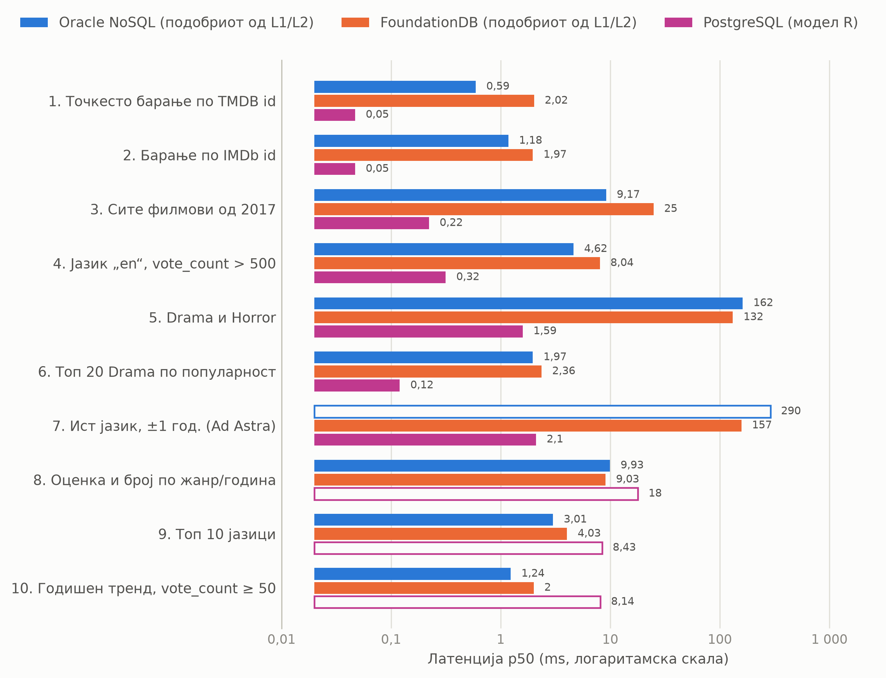
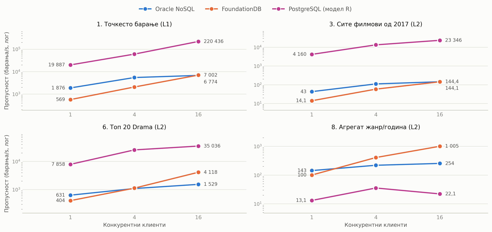

# Query Comparison: Benchmarking two key-value aggregation models (Oracle NoSQL, FoundationDB) against a relational schema (PostgreSQL)

## Overview

This project compares two **key-value databases** — **Oracle NoSQL Database CE** and **FoundationDB** —
against **PostgreSQL** (relational), using the real **TMDB Movies 2000–2020** dataset from Kaggle
(109,222 records). The same records are stored three ways and asked the same ten questions.

It answers two separate questions:

- **Does the aggregation model matter?** The same records are keyed two ways inside each key-value
  store — **L1** fine-grained (one movie per key) and **L2** coarse-grained (one chunk per year).
- **Does the storage paradigm matter?** Each key-value store, at its faster model, against a
  normalized 3NF relational schema (**model R**) on identical data and identical query semantics.

It covers the full pipeline:

1. Kaggle download + normalization
2. Key-value schema creation & bulk load (L1 and L2, both stores)
3. Relational schema creation & bulk load (model R)
4. 10 benchmark queries (Simple / Complex / Aggregate) + concurrency sweep
5. Correctness gate, result tables and performance charts

---

## Prerequisites

Docker Desktop ≥ 4.30 (or Docker Engine + compose plugin), **≥ 6 GB RAM and ≥ 4 CPUs**. All images
are multi-arch — never add a `platform:` key, emulation invalidates every benchmark number.

Each stack starts a server plus a `python:3.11-slim` client; all loaders and benchmarks run inside
the client via `docker exec`. Host ports are for diagnostics only.

#### Oracle NoSQL Database CE
```bash
cd docker/oracle-nosql
docker compose up -d --build

# verify
docker compose exec client python docker/oracle-nosql/smoke_test.py
```

| | |
|---|---|
| Image | `ghcr.io/oracle/nosql:2025-12-ce` — kvlite, single node, KV 25.3.21 |
| Ports | `8080` HTTP proxy · `5001:5000` store · `5999` admin |
| Volume | `kvroot:/kvroot` |
| Healthcheck | `curl -sf http://localhost:8080/V2/nosql/data` |
| Client | `borneo==5.4.3` |

Drivers go through the **HTTP proxy on 8080**, never port 5000 — kvlite registers its storage node
under the container hostname, which a host-side driver cannot route to. `/V2/nosql/data` is the only
healthcheck path that answers; `/` and `/ping` return 400. Host 5000 is taken by macOS AirPlay, hence
the 5001 mapping.

#### FoundationDB 7.3.79
```bash
cd docker/foundationdb
docker compose up -d --build

# mandatory once per fdbdata volume — a fresh cluster has no database until configured
docker exec fdb fdbcli --exec "configure new single ssd"

# verify
docker compose exec client python docker/foundationdb/smoke_test.py
```

| | |
|---|---|
| Image | `foundationdb/foundationdb:7.3.79` |
| Environment | `FDB_NETWORKING_MODE=container` · `FDB_COORDINATOR=fdb` |
| Volumes | `fdbdata:/var/fdb/data` · `fdbconf:/etc/foundationdb` (shared with the client) |
| Configuration | `single` redundancy, `ssd-2` engine, one `fdbserver` process |
| Client | `foundationdb==7.3.79`, API version `730` |

`docker compose down -v` wipes the store and requires `configure new` again; a plain `down`/`up` does
not. The cluster file advertises the container's internal IP, so the database is unreachable from the
host — the `fdbconf` volume is how the client reads the very file the server wrote. The client image
lifts `libfdb_c.so` out of the server image with a multi-stage `COPY`, and the pip version must
exactly equal the image tag.

#### PostgreSQL 17.6
```bash
cd docker/postgres
docker compose up -d --build

# verify
docker compose exec client python docker/postgres/smoke_test.py
```

| | |
|---|---|
| Image | `postgres:17.6-bookworm` |
| Port | `5433:5432` |
| `shm_size` | `1gb` |
| Healthcheck | `pg_isready -U nbp -d tmdb` |
| Client | `psycopg[binary]==3.2.3` |

**The server runs stock** — `shared_buffers` at its 128 MB default, nothing tuned, because kvlite and
`fdbserver` are equally untuned. Two settings are not tuning: `PGDATA` points at a subdirectory or
`initdb` refuses a non-empty volume, and `shm_size: 1gb` replaces Docker's 64 MB default, without
which query 8 fails at 16 clients with *"could not resize shared memory segment"* — parallel workers
pass tuples through POSIX shared memory. Neither key-value store needs it, because neither
parallelizes a single query.

#### Python 3.11+
```bash
python -m venv .venv && source .venv/bin/activate
pip install -r requirements.txt
```

---

## Configuration

There is no `.env` — configuration lives in the three compose files. These are the values the client
containers read, and what to change if you move a database:

```
# Oracle NoSQL
NOSQL_ENDPOINT=http://kvlite:8080

# FoundationDB
FDB_CLUSTER_FILE=/etc/foundationdb/fdb.cluster

# PostgreSQL
PG_DSN=postgresql://nbp:nbp@pg:5432/tmdb
POSTGRES_USER=nbp
POSTGRES_PASSWORD=nbp
POSTGRES_DB=tmdb
```

Query parameters are fixed in `common/keyspec.py`, so all three databases and all three models are
asked literally the same question:

```
PROBE_ID=419704          # Ad Astra          PROBE_YEAR=2017
PROBE_IMDB=tt2935510                         PROBE_LANG=en
PROBE_GENRE=18           # Drama             PROBE_VOTES=500
PROBE_GENRE_B=27         # Horror            MIN_VOTE_COUNT=50
```

**Kaggle API key:**
1. Go to https://www.kaggle.com/settings
2. Click "Create New API Token"
3. Save `kaggle.json` to `~/.kaggle/kaggle.json`, or export `KAGGLE_USERNAME` and `KAGGLE_KEY`

---

## Running the pipeline

Run each step in order, with the three stacks already up.

**STEP 0 — Get the data.** Downloads 21 JSONL files — 109,222 records, 70.85 MB — into `data/`.

```bash
python download.py
```

**STEP 1 — Create the schemas.** Eleven DDL statements for Oracle NoSQL (one L1 table with five
indexes, plus five L2 tables), four tables and four indexes for model R, and none at all for
FoundationDB, whose key space *is* the schema.

```bash
docker exec kv-client python -m common.apply_schema
docker exec pg-client python -m common.apply_schema --model r
```

**STEP 2 — Load and verify.** Loads all 109,222 records into every model, reads back every key
family, and checks 17 invariants against answers computed directly from `data/` — so it is checking
the database, not itself.

```bash
docker exec kv-client  python -m common.live_check
docker exec fdb-client python -m common.live_check
docker exec pg-client  python -m common.live_check --model r
```

**STEP 3 — Measure.** `harness` times all ten queries against every model, discarding warm-ups and
reporting p50/p95/p99. `concurrency` re-runs four representative queries at 1, 4 and 16 client
processes and reports throughput.

```bash
docker exec kv-client  python -m bench.harness
docker exec fdb-client python -m bench.harness
docker exec pg-client  python -m bench.harness --db postgres-r

docker exec kv-client  python -m bench.concurrency
docker exec fdb-client python -m bench.concurrency
docker exec pg-client  python -m bench.concurrency --db postgres-r
```

**STEP 4 — Prove the answers match, then publish.** `answers --compare` checks every implementation
of every query against every other **and** against a brute-force version computed from `data/` with
no database involved. Only then are the tables and charts regenerated from the raw CSVs.

```bash
python -m bench.answers --compare
python -m bench.report > bench/results/report-with-r.md
python -m bench.plots
```

`bash run_model_r.sh` runs steps 1–4 for the relational model end to end.

---

## Key-Value Models (L1 and L2)

**L1 — fine-grained.** One movie per key, five secondary index families. **730,414 keys.**

| Key | Value | Entries |
|---|---|--:|
| `("movie", id)` | the record | 109,222 |
| `("idx", "imdb", id_imdb)` | `pack((id,))` | 109,222 |
| `("idx", "year", year, id)` | `b""` | 103,780 |
| `("idx", "lang", lang, vote_count, id)` | `b""` | 109,222 |
| `("idx", "genre", genre_id, id)` | `b""` | 149,484 |
| `("idx", "genre_pop", genre_id, −popularity×1000, id)` | `b""` | 149,484 |

`genre_pop` stores **negated** scaled popularity, so a forward range read returns most-popular-first
with no client-side sorting. `lang` carries `vote_count` before `id`, turning query 4 into one range
read — 2,611 keys instead of 58,015.

**L2 — coarse-grained. The release year is the unit of aggregation.** Every film of a year is sorted
by id and packed into ~90 KB chunks of ~135 movies; all aggregates are precomputed at load.
**1,867 keys across 49 year buckets.**

| Key | Value | Entries |
|---|---|--:|
| `("year", year, chunk_no)` | JSON array of that year's records, ≤ 90 KB | 806 |
| `("stats", "genre_year", genre_id, year)` | counts, sums, means | 495 |
| `("stats", "lang", lang)` | counts, sums, means | 137 |
| `("stats", "year", year)` | counts, means, rated-only means | 49 |
| `("top", "genre", genre_id, position)` | the record, positions 0–19 | 380 |

Nothing leads from an id, an IMDb id or a genre to a single record — by design. That is what forces
queries 1, 2, 4 and 5 into a full scan under L2.

Oracle NoSQL expresses both models as tables with native indexes and `PRIMARY KEY(SHARD(year), chunk)`;
the stored bytes are identical in both stores.

---

## PostgreSQL Schema (model R)

Third normal form, typed columns, no JSON anywhere.

```sql
genres(genre_id PK, name)
languages(lang_code PK)
movies(id PK, id_imdb UNIQUE, lang_code FK, title, original_title, release_date,
       year GENERATED, overview, popularity, vote_average, vote_count,
       adult, video, poster_path, backdrop_path)
movie_genres(movie_id FK, genre_id FK, PK(movie_id, genre_id))
```

| Table | Rows | |
|---|--:|---|
| `movies` | 109,222 | one row per film |
| `movie_genres` | 149,484 | junction — a film counts once per genre it lists |
| `languages` | 137 | |
| `genres` | 19 | |
| **Total** | **258,862** | |

Indexes — the same five access paths L1 builds by hand, as ordinary B-trees over typed columns:

| Index | Columns | Serves |
|---|---|---|
| `movies_pkey` | `(id)` | Q01 |
| `movies_id_imdb_key` | `(id_imdb)` | Q02 |
| `r_idx_year` | `(year)` | Q03 |
| `r_idx_lang_votes` | `(lang_code, vote_count)` | Q04, Q07 |
| `r_idx_pop` | `(popularity DESC, id)` | Q06 |
| `r_idx_mg_genre` | `(genre_id, movie_id)` | Q05, Q06, Q08 |

`year` is a generated column derived from `release_date`, so it cannot drift; the 5,442 films with no
release date get `NULL`, matching L1, where those records get no entry in the year index either.
`genre_pop` — the one L1 path PostgreSQL could not index over JSON at all — is here just a join
between two indexed tables.

---

## Benchmark Queries

| ID | Category | Description | Favours |
|---|---|---|---|
| Q01 | SIMPLE | Point lookup by TMDB id | L1 |
| Q02 | SIMPLE | Lookup by IMDb id (alternate key) | L1 |
| Q03 | SIMPLE | All movies of year 2017 | L1 |
| Q04 | SIMPLE | Language `en` with `vote_count > 500` | L1 |
| Q05 | COMPLEX | Movies in both Drama and Horror | L1 |
| Q06 | COMPLEX | Top 20 of Drama by popularity | L2 |
| Q07 | COMPLEX | Same language, ±1 year of *Ad Astra* | L2 |
| Q08 | AGGREGATE | Avg rating & count per genre per year, 2000–2020 | L2 |
| Q09 | AGGREGATE | Top 10 languages by count, mean popularity | L2 |
| Q10 | AGGREGATE | Yearly trend, `vote_count ≥ 50` | L2 |
---

## Results Summary

### L1 vs L2 — does the aggregation model matter?

p50 latency in ms.

 **ᶠ** = no access path for this model; the query degrades to a full scan.

| ID | Oracle L1 | Oracle L2 | FDB L1 | FDB L2 | Faster model |
|---|--:|--:|--:|--:|---|
| Q01 | **0.59** | 6,610 ᶠ | **2.02** | 715 ᶠ | L1 — 11,165× · 354× |
| Q02 | **1.18** | 6,560 ᶠ | **1.97** | 708 ᶠ | L1 — 5,573× · 359× |
| Q03 | **9.17** | 20.61 | **24.85** | 69.49 | L1 — 2.2× · 2.8× |
| Q04 | **4.62** | 6,698 ᶠ | **8.04** | 769 ᶠ | L1 — 1,449× · 96× |
| Q05 | **161.85** | 6,584 ᶠ | **131.62** | 756 ᶠ | L1 — 41× · 5.7× |
| Q06 | 627.06 ᶠ | **1.97** | 4.65 | **2.36** | L2 — 319× · 2.0× |
| Q07 | **289.59** ᶠ | 1,054 ᶠ | 310.58 ᶠ | **157.43** | split — Oracle L1 · FDB L2 |
| Q08 | 881.28 ᶠ | **9.93** | 1,263 ᶠ | **9.03** | L2 — 89× · 140× |
| Q09 | 517.82 ᶠ | **3.01** | 1,278 ᶠ | **4.03** | L2 — 172× · 317× |
| Q10 | 934.15 ᶠ | **1.24** | 1,259 ᶠ | **2.00** | L2 — 755× · 629× |

**Final score: L1 11/20 — L2 9/20** (per database, per query)

| | L1 | L2 |
|---|--:|--:|
| Keys | 730,414 | 1,867 |
| Logical size | 90.35 MB | 69.13 MB |
| Load — Oracle NoSQL | 56.8 s | 4.7 s |
| Load — FoundationDB | 6.8 s | 0.4 s |

Key takeaways:
- **Neither model wins everything** — L1 takes every lookup and selective filter by up to four orders
  of magnitude, L2 takes every aggregate by up to three. The 11/9 split is the result.
- **L2 costs almost nothing to carry** — 1,867 keys and 0.33 MB of precomputed aggregates, so keeping
  it alongside L1 is close to free, and that is the practical recommendation.
- **Design the key, not just the index** — the sharpest gap between the two key-value stores is Q06 on
  L1 (**135×**: FoundationDB 4.65 ms, Oracle NoSQL 627 ms), and it comes entirely from putting a
  negated sort component *inside* the key instead of an index plus `ORDER BY`.
- **A missing access path costs ~8.7× more on Oracle NoSQL** than on FoundationDB — 6.6 s against
  0.77 s for the same L2 full scan.

At its best model, **Oracle NoSQL beats FoundationDB 7–3**.

### Key-value vs relational — does the storage paradigm matter?

Each key-value store at its faster model, against PostgreSQL model R. p50 in ms.



| ID | Oracle NoSQL | FoundationDB | PostgreSQL R | Winner |
|---|--:|--:|--:|---|
| Q01 | 0.59 | 2.02 | **0.05** | PostgreSQL 11.8× |
| Q02 | 1.18 | 1.97 | **0.05** | PostgreSQL 24× |
| Q03 | 9.17 | 24.85 | **0.22** | PostgreSQL 42× |
| Q04 | 4.62 | 8.04 | **0.32** | PostgreSQL 14× |
| Q05 | 161.85 | 131.62 | **1.59** | PostgreSQL 83× |
| Q06 | 1.97 | 2.36 | **0.12** | PostgreSQL 16× |
| Q07 | 289.59 ᶠ | 157.43 | **2.10** | PostgreSQL 75× |
| Q08 | 9.93 | **9.03** | 17.90 ᶠ | FoundationDB 2.0× |
| Q09 | **3.01** | 4.03 | 8.43 ᶠ | Oracle NoSQL 2.8× |
| Q10 | **1.24** | 2.00 | 8.14 ᶠ | Oracle NoSQL 6.6× |

**Final score: PostgreSQL 7/10 — key-value 3/10**

Throughput at 16 concurrent clients, in ops/s:



| Query | Oracle NoSQL | FoundationDB | PostgreSQL R |
|---|--:|--:|--:|
| Q01 point lookup | 6,774 | 7,002 | **220,436** |
| Q03 year 2017 | 144 | 144 | **23,346** |
| Q06 top-20 genre | 1,529 | 4,118 | **35,036** |
| Q08 genre × year | 254 | **1,005** | 22 |

Key takeaways:
- **The relational model won 7 of 10 — and lost exactly the three aggregates**, where L2 reads a
  precomputed stat row while PostgreSQL scans 109,222 rows. That is a materialization result, not a
  paradigm result: any of the three engines could have precomputed those.
- **The gap is widest where the relational engine has a real index** — 83× on Q05, 75× on Q07, and
  31× the key-value stores on point lookups at 16 concurrent clients.
- **What key-value bought was predictability, not speed.** PostgreSQL answers Q06 in 0.12 ms by
  walking the popularity index backwards and discarding non-matches — a plan that works *because
  Drama is 33.5 % of the corpus*. FoundationDB's key costs the same for Drama and for Western.
- **Cores are used three different ways** — PostgreSQL parallelizes a single query (4.41× on Q08 at
  stock settings), Oracle NoSQL gains only under concurrency (1.93×), FoundationDB gains nothing
  (0.92×) because its scaling unit is processes, not cores.
- **At 68 MB on one node, neither key-value store is being asked the question it was built for** —
  which is the honest frame for the whole scoreboard.

---

## What the numbers measure

- **Median execution time (p50, ms)** — over 200 runs for point queries, 50 for indexed ranges, 20 for
  complex, 5 for aggregates, 3 for full scans. Warm-ups discarded; p95/p50 never exceeds 3×.
- **Throughput (ops/s)** — over an 8-second window per configuration, at 1, 4 and 16 client processes.
- **Speed-up ratio** — slower p50 ÷ faster p50, on the same query returning the identical answer.
- **Idiomatic implementations, identical semantics** — Oracle NoSQL uses `GROUP BY` where FoundationDB
  scans client-side, and PostgreSQL uses `LATERAL`/`FILTER`; the client libraries are part of what is
  measured.

---

## Limitations

- **One run per configuration** — the protocol asks for three. Tight p95/p50 ratios suggest the
  medians are stable, but they are not replicated.
- **L1 and L2 share a store** — a query may hit cache warmed by the other model, and the footprint
  figures are combined rather than per-model.
- **Model R was measured in a separate sitting** from the key-value runs, on the same machine.
- **Neither NoSQL store runs as a cluster** — kvlite is single-node by design, FoundationDB runs one
  `fdbserver` with `single` redundancy. Replication, sharding and scale-out are untested, and
  `configure double ssd` is the missing experiment its flat core-scaling result calls for.
- **No query plan is available for either key-value store** — kvlite exposes no `EXPLAIN` through the
  proxy and FoundationDB has no planner, so Q06's 135× gap is explained by inference. Only
  PostgreSQL's plans are captured.
- **The workload is read-only** — FoundationDB's distributed ACID transactions and Oracle NoSQL's
  partitioning are costs paid here for benefits never exercised.

The condition most likely to change the headline: **68 MB fits in RAM.** Re-running at a size that
does not is the experiment that would test whether the relational engine still wins.